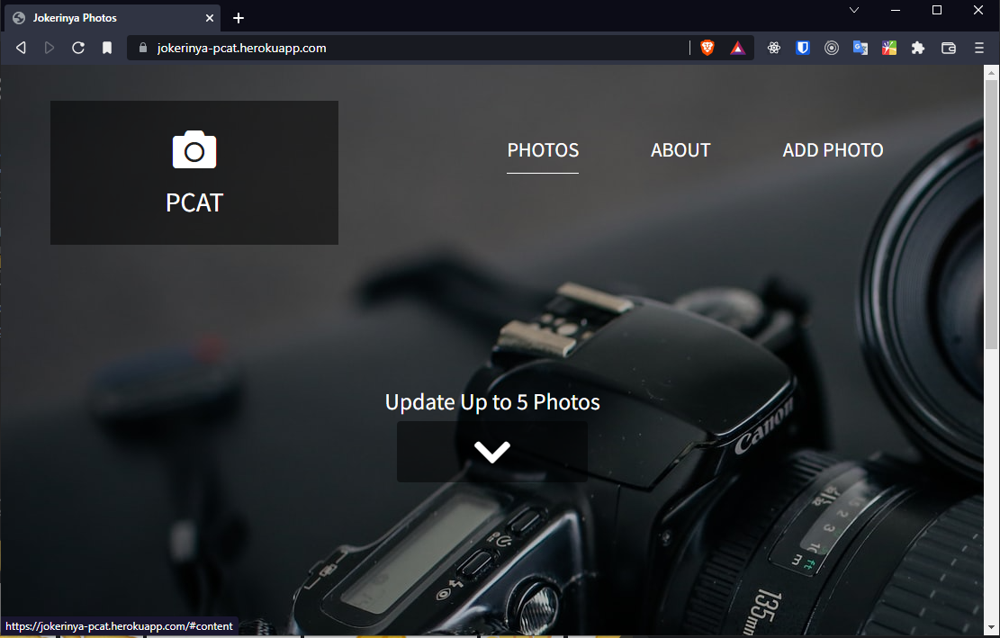

# PCAT

This is a self-learning small project that has been done with <a href="https://www.patika.dev/" target="_blank">patika.dev</a> `NodeJs` course.

👉This site is online at <a href="https://jokerinya-pcat.herokuapp.com/" target="_blank">here</a> (heroku platform). `MongoDB` have been used for DB.

<small>Heroku Platform is ephemeral. That means you may not be see uploaded image after some time later. For more <a href="https://devcenter.heroku.com/articles/dynos#ephemeral-filesystem" target="_blank">information.</a>



</small>

For installing packages

```bash
npm install
```

and to start the server,

```bash
npm start
```

_Don't forget to add your credentials to `.env` file._

## In this course I learned _(for NodeJs enviroment)_,

- `express` framework,
- `nodemon` package usage,
- `ejs` template structure,
- Middlewares and `method-override` package,
- MVC structure,
- Routing,
- File Uploading `express-fileupload` package,
- Mongoose `Model` structure,
- Pagination feature,
- `dotenv` package,
- MongoDB atlas usage.

Of course not all of them has been showed int the course content. In addition to course content, **I added some extra specaialty to this small project.**

- All the uncessary pages that were in the template has been cleaned,
- Only 5 images can be added to page at the same time,
- `dotenv` package has been added for credentials,
- All other routes has been catched in the project host name,
- Error page has been added for custom errors.
